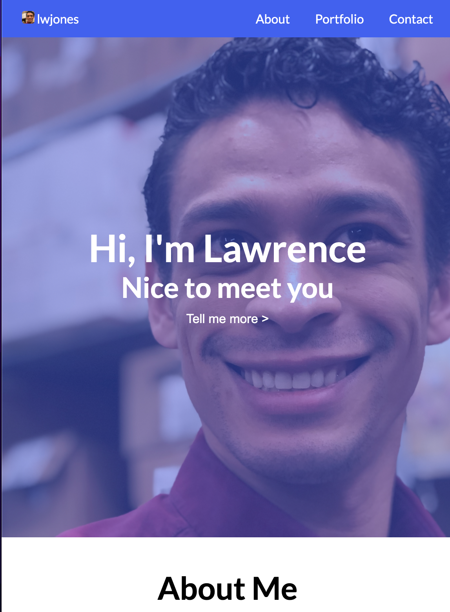

# lwjones.github.io

## Description

Here's where you can find all the work made into my personal site. You could find it [here at lwjones.github.io](https://lwjones.github.io).

For now there is still a lot more work I want to put into this site. Hosting more links to projects (some of them don't direct anywhere and are just sample images), having some more content; there's definitely more to add over time.

## Features

- You can learn more about me (and see a photo of me)
- You can see where you can connect with me
- You can see some of my featured projects

## Credits

The following resources were used:

- [Google Fonts](https://fonts.google.com)
- [Pixabay](https://pixabay.com)
- [Font Awesome](https://fontawesome.com)